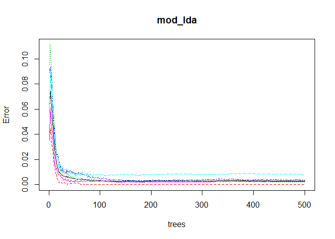

Practical Machine Learning - Project
================
KF
February 25, 2018

Synopsis
========

Using devices such as Jawbone Up, Nike FuelBand, and Fitbit it is now possible to collect a large amount of data about personal activity relatively inexpensively. These type of devices are part of the quantified self movement - a group of enthusiasts who take measurements about themselves regularly to improve their health, to find patterns in their behavior, or because they are tech geeks. One thing that people regularly do is quantify how much of a particular activity they do, but they rarely quantify how well they do it. In this project, your goal will be to use data from accelerometers on the belt, forearm, arm, and dumbell of 6 participants. They were asked to perform barbell lifts correctly and incorrectly in 5 different ways.

Goal
====

The goal of your project is to predict the manner in which they did the exercise. This is the "classe" variable in the training set. You may use any of the other variables to predict with. You should create a report describing how you built your model, how you used cross validation, what you think the expected out of sample error is, and why you made the choices you did. You will also use your prediction model to predict 20 different test cases.

Data
====

Training data: <https://d396qusza40orc.cloudfront.net/predmachlearn/pml-training.csv>

Test data:

<https://d396qusza40orc.cloudfront.net/predmachlearn/pml-testing.csv>

Loading in required packages

``` r
library(data.table);library(caret);library(rpart);library(rpart.plot)
```

    ## Warning: package 'data.table' was built under R version 3.3.2

    ## Warning: package 'caret' was built under R version 3.3.3

    ## Warning: package 'ggplot2' was built under R version 3.3.3

    ## Warning: package 'rpart.plot' was built under R version 3.3.3

``` r
library(RColorBrewer);library(rattle);library(randomForest);library(knitr);library(e1071)
```

    ## Warning: package 'RColorBrewer' was built under R version 3.3.2

    ## Warning: package 'rattle' was built under R version 3.3.3

    ## Warning: package 'randomForest' was built under R version 3.3.3

    ## Warning: package 'knitr' was built under R version 3.3.3

    ## Warning: package 'e1071' was built under R version 3.3.3

Read in data from csv hyperlink.

``` r
link_train <- "http://d396qusza40orc.cloudfront.net/predmachlearn/pml-training.csv"
link_test <- "http://d396qusza40orc.cloudfront.net/predmachlearn/pml-testing.csv"
trainRaw <- read.csv(url(link_train), na.strings=c("NA","#DIV/0!",""))
testRaw <- read.csv(url(link_test), na.strings=c("NA","#DIV/0!",""))  
```

The training set will be split 70/30 (70% to build the model and 30% to test model against before applying to true testing data).

``` r
set.seed(42)
train_split <- createDataPartition(trainRaw$classe, p =0.7, list = FALSE)
train_1 <- trainRaw[train_split,]
train_2 <- trainRaw[-train_split,]
dim(train_1); dim(train_2)
```

    ## [1] 13737   160

    ## [1] 5885  160

Data cleansing and preparation
------------------------------

There will be two pieces to data preparation and cleansing. The first step is to run the function nearZeroVar to see which variables have little variability and will therefore not be good predictors.

``` r
nzv <- nearZeroVar(train_1, saveMetrics=TRUE)
train_1 <- train_1[,nzv$nzv==FALSE]
train_2 <- train_2[,nzv$nzv==FALSE]
dim(train_1); dim(train_2)
```

    ## [1] 13737   128

    ## [1] 5885  128

Identifying clutter variables that do not have sufficient data to build into models. These are columns with highest NA counts. na\_count is a vector that contains TRUE if the column has no NAs. These are the columns we want to incorporate into our model building

``` r
discardColumns <- sapply(train_1, function(x) mean(is.na(x))) > 0.95
train_1 <- train_1[, discardColumns==F]
train_2 <- train_2[, discardColumns==F]
dim(train_1); dim(train_2)
```

    ## [1] 13737    59

    ## [1] 5885   59

``` r
#dropping these five irrelevant columns
knitr::kable(train_1[1:5,1:5])
```

|     |    X| user\_name |  raw\_timestamp\_part\_1|  raw\_timestamp\_part\_2| cvtd\_timestamp  |
|-----|----:|:-----------|------------------------:|------------------------:|:-----------------|
| 2   |    2| carlitos   |               1323084231|                   808298| 05/12/2011 11:23 |
| 3   |    3| carlitos   |               1323084231|                   820366| 05/12/2011 11:23 |
| 6   |    6| carlitos   |               1323084232|                   304277| 05/12/2011 11:23 |
| 7   |    7| carlitos   |               1323084232|                   368296| 05/12/2011 11:23 |
| 8   |    8| carlitos   |               1323084232|                   440390| 05/12/2011 11:23 |

``` r
train_1 <- train_1[, -c(1:5)]
train_2 <- train_2[, -c(1:5)]
dim(train_1); dim(train_2)
```

    ## [1] 13737    54

    ## [1] 5885   54

Modeling
--------

Ising the train\_1 dataframe, I constructed three models using Random forest. 1. Random Forest 2. Generalized Boosted Regression (gbm) 3. Linear discriminate analysis These three models will be built using train\_1 and predicted on train\_2

``` r
mod_rf <- randomForest(classe ~ ., data = train_1, method = "rf")
mod_gbm <- randomForest(classe ~ ., data = train_1, method = "gbm")
mod_lda <- randomForest(classe ~ ., data = train_1, method = "lda")
p_rf <- predict(mod_rf, train_2)
p_gbm <- predict(mod_gbm, train_2)
p_lda <- predict(mod_lda, train_2)
```

Storing the accuracy metric for these three models:

``` r
accuracy_rf <- postResample(p_rf, train_2$classe)
accuracy_gbm <- postResample(p_gbm, train_2$classe)
accuracy_lda <- postResample(p_lda, train_2$classe)
accuracy_rf; accuracy_gbm; accuracy_lda
```

    ##  Accuracy     Kappa 
    ## 0.9976211 0.9969907

    ##  Accuracy     Kappa 
    ## 0.9976211 0.9969907

    ##  Accuracy     Kappa 
    ## 0.9981308 0.9976356

From the accuracy output, we can see the lda model has the highest accuracy and lowest out-of-sample error rate.

``` r
mod_lda #our OOB estimate of error rate: 0.3%
```

    ## 
    ## Call:
    ##  randomForest(formula = classe ~ ., data = train_1, method = "lda") 
    ##                Type of random forest: classification
    ##                      Number of trees: 500
    ## No. of variables tried at each split: 7
    ## 
    ##         OOB estimate of  error rate: 0.29%
    ## Confusion matrix:
    ##      A    B    C    D    E  class.error
    ## A 3905    1    0    0    0 0.0002560164
    ## B    5 2652    1    0    0 0.0022573363
    ## C    0    9 2387    0    0 0.0037562604
    ## D    0    0   17 2234    1 0.0079928952
    ## E    0    0    0    6 2519 0.0023762376

``` r
plot(mod_lda)
```



``` r
confusionMatrix(train_2$classe, p_lda)
```

    ## Confusion Matrix and Statistics
    ## 
    ##           Reference
    ## Prediction    A    B    C    D    E
    ##          A 1674    0    0    0    0
    ##          B    1 1138    0    0    0
    ##          C    0    4 1022    0    0
    ##          D    0    0    6  958    0
    ##          E    0    0    0    0 1082
    ## 
    ## Overall Statistics
    ##                                           
    ##                Accuracy : 0.9981          
    ##                  95% CI : (0.9967, 0.9991)
    ##     No Information Rate : 0.2846          
    ##     P-Value [Acc > NIR] : < 2.2e-16       
    ##                                           
    ##                   Kappa : 0.9976          
    ##  Mcnemar's Test P-Value : NA              
    ## 
    ## Statistics by Class:
    ## 
    ##                      Class: A Class: B Class: C Class: D Class: E
    ## Sensitivity            0.9994   0.9965   0.9942   1.0000   1.0000
    ## Specificity            1.0000   0.9998   0.9992   0.9988   1.0000
    ## Pos Pred Value         1.0000   0.9991   0.9961   0.9938   1.0000
    ## Neg Pred Value         0.9998   0.9992   0.9988   1.0000   1.0000
    ## Prevalence             0.2846   0.1941   0.1747   0.1628   0.1839
    ## Detection Rate         0.2845   0.1934   0.1737   0.1628   0.1839
    ## Detection Prevalence   0.2845   0.1935   0.1743   0.1638   0.1839
    ## Balanced Accuracy      0.9997   0.9981   0.9967   0.9994   1.0000

Predict on test set using the lda model:

``` r
result_lda <- predict(mod_lda, testRaw)
result_lda
```

    ##  1  2  3  4  5  6  7  8  9 10 11 12 13 14 15 16 17 18 19 20 
    ##  B  A  B  A  A  E  D  B  A  A  B  C  B  A  E  E  A  B  B  B 
    ## Levels: A B C D E

Generate txt file containing results.

``` r
lapply(result_lda, function(x) write.table( data.frame(x), 'results.txt'  , append= T, sep=',' ))
```
